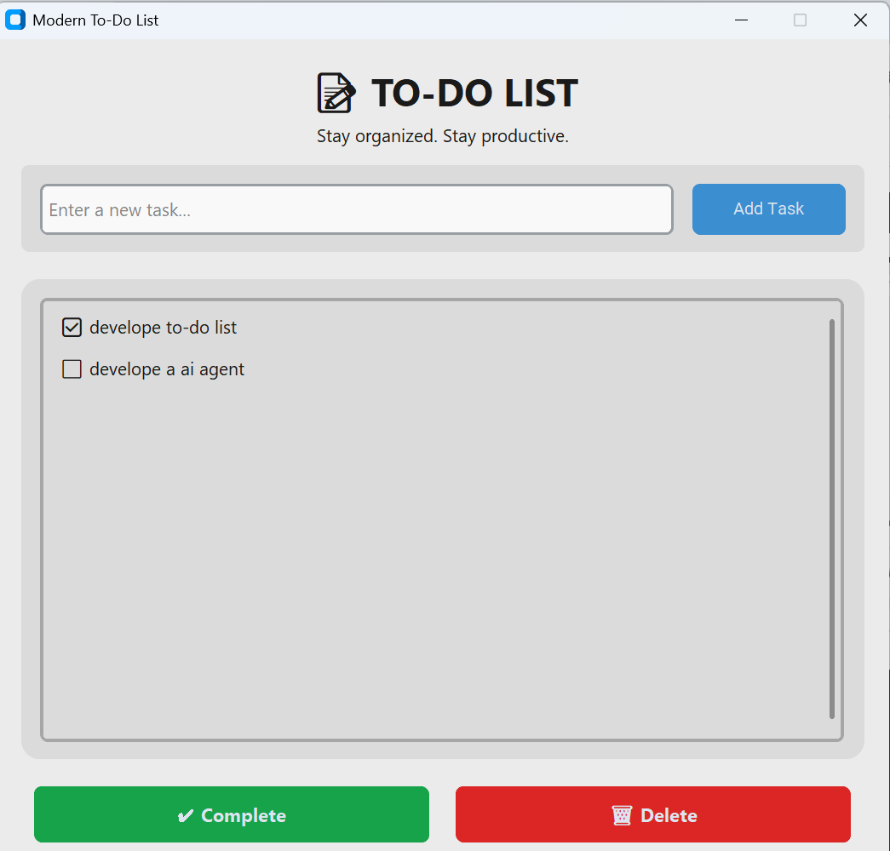

# 📝 Modern To-Do List App

A modern and user-friendly **To-Do List Desktop Application** built with **Python**, **CustomTkinter**, and **CTkListbox**. The application features a clean and responsive interface that allows users to efficiently manage their daily tasks by adding, selecting, completing, and deleting tasks with a single click.

---

## ✨ Features

- ➕ Add new tasks
- ✅ Mark tasks as completed
- 🗑️ Delete selected tasks
- 🖱️ Select tasks with a single click
- ⌨️ Press **Enter** to quickly add a task
- 🎨 Modern UI built with CustomTkinter
- 💻 Responsive desktop layout
- 🌞 Light theme with rounded components
- 🚀 Simple and intuitive user experience

---

## 📸 Preview

> Add a screenshot of your application here.

<p align="center">
  
</p>

---

## 🛠️ Technologies Used

- **Python 3**
- **CustomTkinter**
- **CTkListbox**
- **Tkinter**

---

## 📦 Installation

### 1. Clone the repository

```bash
git clone https://github.com/EL-MAIMOUNI-MOHAMED/TO-DO-LIST.git
```

### 2. Navigate to the project directory

```bash
cd modern-todo-list
```

### 3. Install the required dependencies

```bash
pip install customtkinter CTkListbox
```

### 4. Run the application

```bash
python main.py
```

---

## 📂 Project Structure

```
modern-todo-list/
│
├── main.py
├── README.md
└── screenshots/
    └── preview.png
```

---

## 🚀 Future Improvements

- 💾 Save tasks locally using JSON or SQLite
- 🌙 Dark mode support
- 📅 Due dates and reminders
- ⭐ Task priorities
- 📂 Task categories
- 🔍 Search and filter tasks
- 📊 Task statistics dashboard
- ☁️ Cloud synchronization

---

## 🤝 Contributing

Contributions are welcome!

1. Fork this repository.
2. Create a new feature branch.

```bash
git checkout -b feature-name
```

3. Commit your changes.

```bash
git commit -m "Add new feature"
```

4. Push your branch.

```bash
git push origin feature-name
```

5. Open a Pull Request.

---

## 📄 License

This project is licensed under the **MIT License**.

---

## 👨‍💻 Author

### Mohamed EL MAIMOUNI

**💼 Full-Stack Developer | AI & Machine Learning Engineer**

Passionate about developing modern web applications, intelligent AI solutions, and user-centered software that solves real-world problems.

- 🔗 **LinkedIn:** https://www.linkedin.com/in/mohamed-el-maimouni/

---

## ⭐ Support

If you found this project useful, please consider giving it a **⭐ Star** on GitHub. Your support is greatly appreciated!
